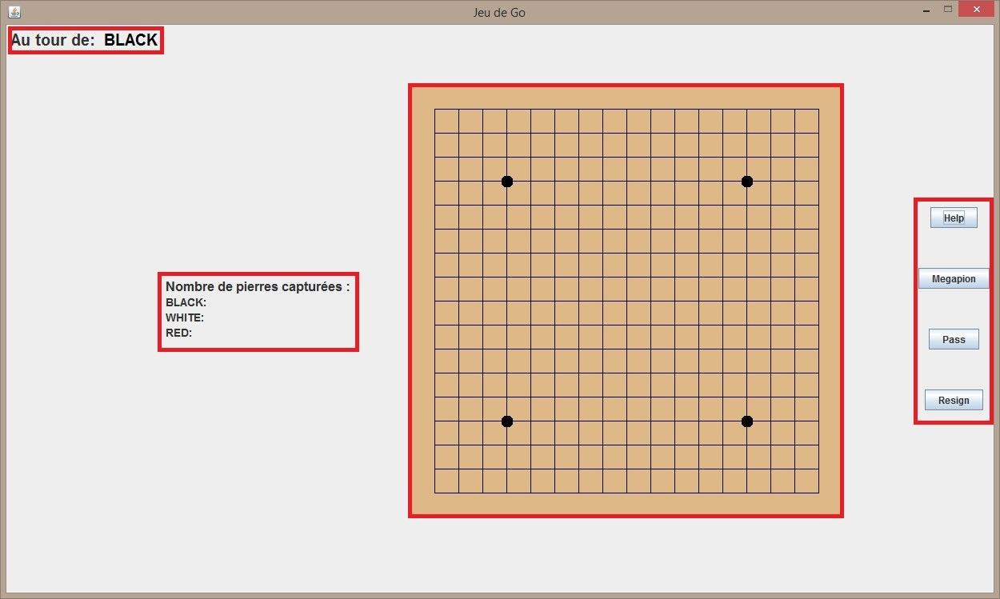
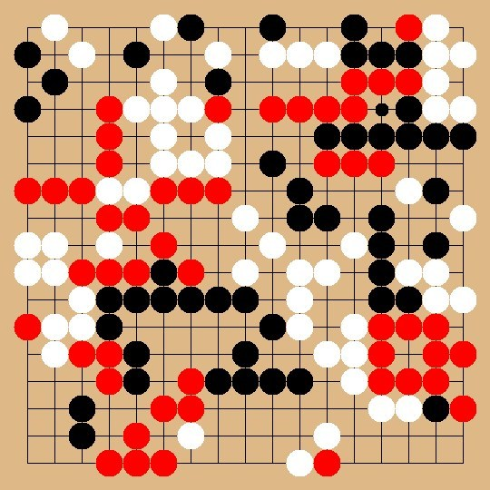
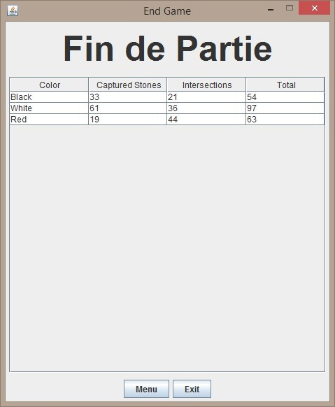

# Go Game

The project consist to develop a go game (korean traditional game) but with some exciting new rules :  
* 3-players games (black, white and red stones).  
* 1 Megastone by player per game (permite to eliminate all stones near to this megastone).  
* Basic AI to play against the computer.  
Licence 2 project made for the Genie Logiciel cursus at CY Paris Université.  
Made by Da Cruz Mathis, Afatchawo Junior, Chriqui Nathan.  
  
Here, some pictures from our game :

The main window :   

The goban's aspect after a game :  

The endgame window which display all the scores :  

